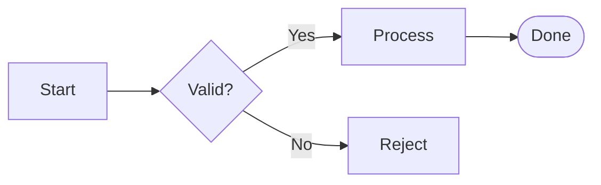

<p align="center">
  <picture>
    <source media="(prefers-color-scheme: dark)" srcset="public/brand/mdtopdf-logo-dark.png">
    
  </picture>
</p>

<p align="center">
  Convert Markdown to clean, print-ready PDFs — with LaTeX math, syntax-highlighted code, and diagrams.
</p>

<p align="center">
  <a href="#installation">Install</a> ·
  <a href="#usage">Usage</a> ·
  <a href="#math">Math</a> ·
  <a href="#code-highlighting">Highlighting</a> ·
  <a href="#diagrams">Diagrams</a> ·
  <a href="#web-app">Web app</a>
</p>

---

## Overview

`mdtopdf` turns a Markdown file into a PDF from the command line — no GUI, no
online service, one command:

```bash
mdtopdf notes.md
```

## Features

- **LaTeX math** rendered with [KaTeX](https://katex.org) — fonts embedded, no network needed
- **Syntax highlighting** for ~200 languages via [highlight.js](https://highlightjs.org), with selectable themes
- **Diagrams** from [Mermaid](https://mermaid.js.org) — flowcharts, sequence diagrams, and more
- **Adjustable text size**, proportional across body, headings, code, and math

## Requirements

- **Node.js** 16 or newer
- A **Chromium-based browser**: Chrome, Brave, or Edge (macOS) · Chrome or Chromium (Linux)
- No `pip` packages required

## Installation

### Linux / macOS

```bash
git clone https://github.com/AdamYahmadi/mdtopdf.git
cd mdtopdf
npm install
chmod +x mdtopdf

# install the command globally
sudo cp mdtopdf render.js mdtohtml.js /usr/local/bin/
sudo rm -rf /usr/local/bin/node_modules
sudo cp -r node_modules /usr/local/bin/node_modules
```

After this, `mdtopdf` is available from anywhere in your terminal.

## Usage

```bash
# convert to a PDF of the same name (notes.md -> notes.pdf)
mdtopdf notes.md

# choose the output file
mdtopdf notes.md -o report.pdf

# pick a code highlighting theme (default: light)
mdtopdf notes.md --theme github-dark
mdtopdf notes.md -t one-dark

# set the base text size in px (default: 13)
mdtopdf notes.md --size 16
mdtopdf notes.md -s 11

# options combine freely
mdtopdf notes.md --theme tokyo-night --size 16 -o report.pdf
```

### Options

| Option | Alias | Description | Default |
| ------ | ----- | ----------- | ------- |
| `--output` | `-o` | Output PDF path | same name as input |
| `--theme` | `-t` | Code highlighting theme (see below) | `light` |
| `--size` | `-s` | Base text size in px (8–28) | `13` |
| `--help` | `-h` | Show help | — |

## Math

LaTeX math is rendered with KaTeX at build time.
Four delimiter styles are supported:

| Style        | Inline      | Display       |
| ------------ | ----------- | ------------- |
| Dollar signs | `$ ... $`   | `$$ ... $$`   |
| LaTeX native | `\( ... \)` | `\[ ... \]`   |

For example, this Markdown:

```markdown
The identity $e^{i\pi} + 1 = 0$ appears inline.

$$\int_{-\infty}^{\infty} e^{-x^2}\,dx = \sqrt{\pi}$$
```

renders as:

> The identity $e^{i\pi} + 1 = 0$ appears inline.
>
> $$\int_{-\infty}^{\infty} e^{-x^2}\ dx = \sqrt{\pi}$$

## Code highlighting

Fenced code blocks are syntax-highlighted (~200 languages, auto-detected).

Choose a theme with `--theme`:

| Theme         | Style           |
| ------------- | --------------- |
| `light`       | light (default) |
| `github`      | light           |
| `github-dark` | dark            |
| `one-dark`    | dark            |
| `tokyo-night` | dark            |

```bash
mdtopdf notes.md --theme tokyo-night
```

## Diagrams

Fenced `mermaid` blocks are rendered as diagrams — flowcharts, sequence
diagrams, class diagrams, state diagrams, and more (see the
[Mermaid docs](https://mermaid.js.org) for the full syntax).

````markdown

````

renders as:



Diagrams follow the selected `--theme` (dark themes render dark diagrams).

> [!NOTE]
> Diagram rendering fetches the Mermaid library at build time, so it requires an
> internet connection. Math, code highlighting, and everything else stay fully
> offline.

## Text size

The base text size can be changed with `--size` (8–28 px, default 13).

```bash
mdtopdf notes.md --size 16
```

## Web app

A browser-based editor with **live preview** and one-click PDF download runs the
**same pipeline** as the CLI.

**Try it now:** **[mdtopdf.adamyahmadi.com](https://mdtopdf.adamyahmadi.com/)**

Or run it locally:

```bash
npm start
```

Then open <http://localhost:3000>